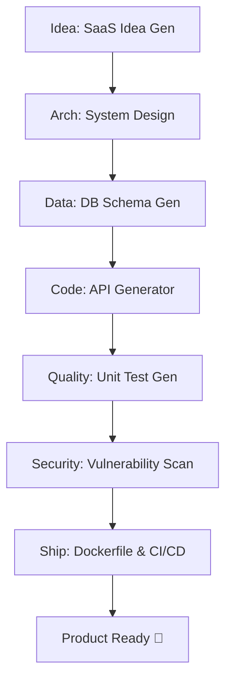
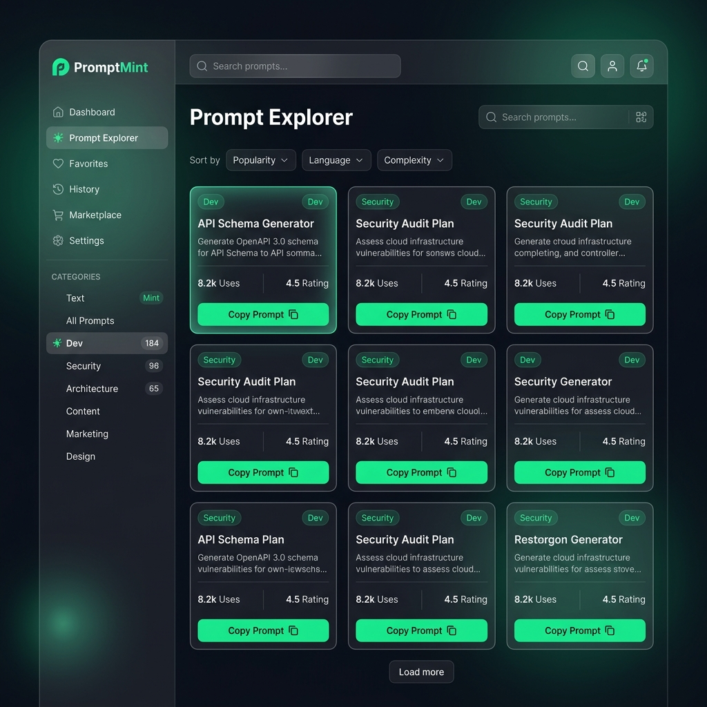

  

# 🍃 PromptMint: The Developer's AI Blueprint

> Build, ship, and scale AI-powered applications with 50+ production-ready, battle-tested prompts. 🚀

**PromptMint** is a professional-grade collection of reusable prompts and structured workflows. It bridges the gap between raw LLM capabilities and real-world software engineering, providing developers with a consistent, reliable "blueprint" for AI integration.

---

## ⚡ Quick Examples (The "WOW" Factor)

| Category | Input | Output |
| :--- | :--- | :--- |
| **Code Review** | Messy, unoptimized code | Optimized, secure, & documented version |
| **System Design** | Feature requirements | High-level architecture & tech stack |
| **Security Audit** | Code snippet | OWASP vulnerability report & secure fix |
| **API Generator** | Endpoint name/logic | Full REST/GraphQL structure & validation |

---

## ⚙️ Advanced Features

This toolkit is built for production environments.

- **YAML Configs**: All prompts are available in YAML format for easy integration into custom pipelines. [View Configs](file:///e:/Githubrepo/prompttoolkit/configs/code-review.yaml)
- **Evaluation Framework**: Use our [Evaluation Matrix](file:///e:/Githubrepo/prompttoolkit/testing/evaluation-guide.md) to test and score prompt outputs.
- **Strict Versioning**: We follow semantic versioning. Track changes in the [CHANGELOG.md](file:///e:/Githubrepo/prompttoolkit/CHANGELOG.md).

---

## 🛠️ Visual Workflow: From Idea to Production

👉 **[Read the Deep-Dive Workflow Guide](file:///e:/Githubrepo/prompttoolkit/workflows/idea-to-production.md)**

---

## 📂 The Prompt Library (50+ Resources)

### 🧑‍💻 Core Development
- [Code Review](file:///e:/Githubrepo/prompttoolkit/prompts/code-review.md)
- [Bug Fixing](file:///e:/Githubrepo/prompttoolkit/prompts/bug-fixer.md)
- [Unit Testing](file:///e:/Githubrepo/prompttoolkit/prompts/unit-test-generator.md)
- [Unit Test Mocks](file:///e:/Githubrepo/prompttoolkit/prompts/unit-test-mocks.md)
- [Refactoring Legacy Code](file:///e:/Githubrepo/prompttoolkit/prompts/legacy-refactor.md)
- [Regex Master](file:///e:/Githubrepo/prompttoolkit/prompts/regex-master.md)
- [SQL Query Generator](file:///e:/Githubrepo/prompttoolkit/prompts/sql-query-generator.md)

### 🏗️ Architecture & Advanced Backend
- [System Design](file:///e:/Githubrepo/prompttoolkit/prompts/system-design.md)
- [Microservices Architect](file:///e:/Githubrepo/prompttoolkit/prompts/microservices-arch.md)
- [Database Schema](file:///e:/Githubrepo/prompttoolkit/prompts/database-schema.md)
- [GraphQL Schema](file:///e:/Githubrepo/prompttoolkit/prompts/graphql-gen.md)
- [Mobile App Architecture](file:///e:/Githubrepo/prompttoolkit/prompts/mobile-arch.md)
- [Product Roadmap](file:///e:/Githubrepo/prompttoolkit/prompts/product-roadmap.md)
- [SaaS Idea Generator](file:///e:/Githubrepo/prompttoolkit/prompts/saas-idea-generator.md)
- [Startup Pitch](file:///e:/Githubrepo/prompttoolkit/prompts/startup-pitch.md)

### 🚀 DevOps & Automation
- [CI/CD Pipeline Builder](file:///e:/Githubrepo/prompttoolkit/prompts/cicd-pipeline.md)
- [Kubernetes Generator](file:///e:/Githubrepo/prompttoolkit/prompts/kubernetes-gen.md)
- [Cloud Infrastructure (IaC)](file:///e:/Githubrepo/prompttoolkit/prompts/cloud-infrastructure.md)
- [Dockerfile Generator](file:///e:/Githubrepo/prompttoolkit/prompts/dockerfile-generator.md)
- [Shell Script Expert](file:///e:/Githubrepo/prompttoolkit/prompts/shell-script-expert.md)
- [Git Commit Generator](file:///e:/Githubrepo/prompttoolkit/prompts/git-commit-generator.md)
- [Git Branching Strategy](file:///e:/Githubrepo/prompttoolkit/prompts/git-branching.md)

### 🛡️ Security & Observability
- [Security Vulnerability Scanner](file:///e:/Githubrepo/prompttoolkit/prompts/security-scanner.md)
- [Auth & Security Validator](file:///e:/Githubrepo/prompttoolkit/prompts/auth-validator.md)
- [Environment Variables Strategy](file:///e:/Githubrepo/prompttoolkit/prompts/env-vars.md)
- [Performance Profiler](file:///e:/Githubrepo/prompttoolkit/prompts/performance-profiler.md)
- [Logging & Monitoring](file:///e:/Githubrepo/prompttoolkit/prompts/logging-monitoring.md)
- [Error Handling Strategy](file:///e:/Githubrepo/prompttoolkit/prompts/error-handler.md)

---

## 🗺️ Vision & Roadmap

We are building the first open-source **Prompt Explorer UI** to help you browse, test, and copy prompts with a single click.

  

- [ ] Interactive Prompt Explorer Web App
- [ ] VS Code Extension for instant prompt insertion
- [ ] CLI Tool for pipeline integration
- [ ] Community-driven prompt marketplace

---

## 🤝 Contributing

Contributions are welcome! If you have a powerful prompt, feel free to open a PR.

## ⭐ Support the Project

If you find **PromptMint** useful, please consider **starring the repository** on GitHub! It helps other developers find the project and motivates further updates.
